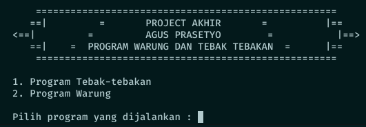
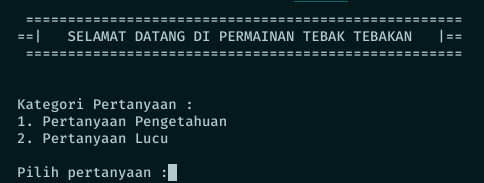
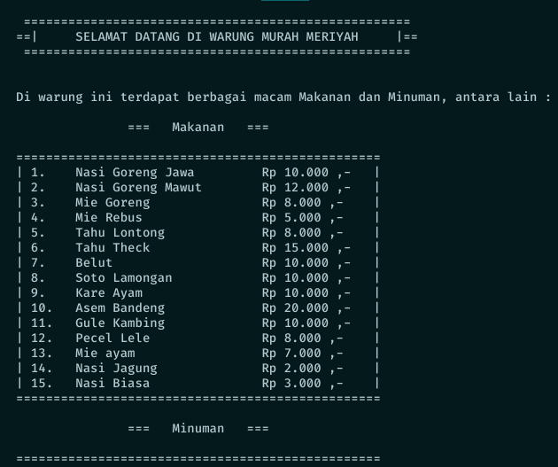

# Project Akhir Pemrograman Dasar

- Judul : Program Tebak-tebakan & Program warung
- Mata Kuliah : Pemrograman Dasar
- Semester : 1 (Satu)
- Tanggal : 25 Januari 2018

# How to use
- Download file ini
- Compile file `.java` yang sudah di download dengan cara `javac ProjectUAS.java`
- Jalankan file tersebut dengan cara `java ProjectUAS`
- Tadaaaa . . . file sudah bisa dijalankan

# Screenshot

1. Bagian Menu Awal

2. Program Tebak-tebakan

3. Program Warung
